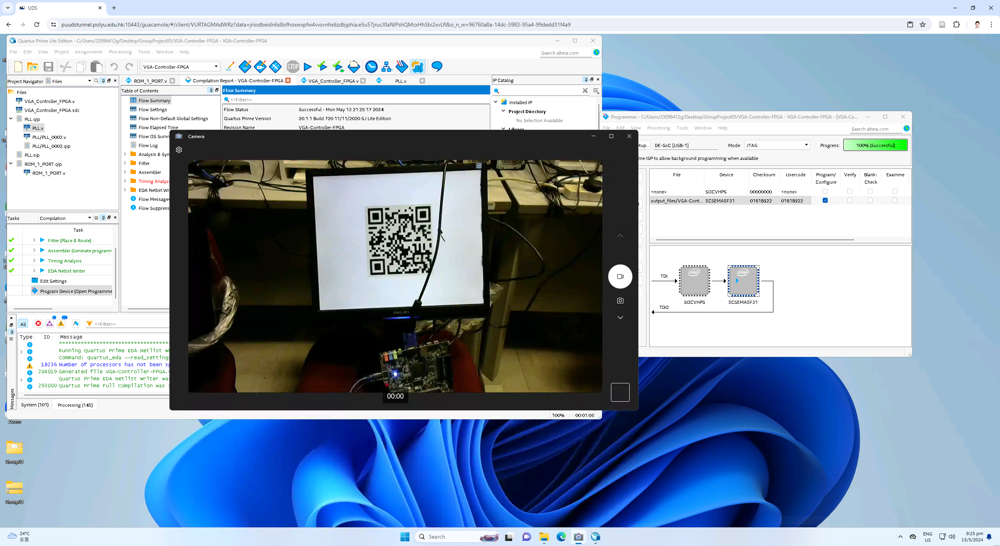

# VGA Controller FPGA

This project, VGA_Controller_FPGA, is an Intel Quartus project designed to display a specific 256x256 8-bit image using the RGB332 color model.

## Project Overview

The VGA_Controller_FPGA project is designed to control a VGA (Video Graphics Array) display by generating the necessary timing signals and outputting pixel data to display a specific image.

## Features

- Display a 256x256 8-bit image (Example:QR code)
- Utilizes the RGB332 color model

## Getting Started

### Prerequisites

- Intel Quartus (Quartus Prime 20.1) Lite Edition
- FPGA board

### Installation

1. Clone the repository
2. Open the project in Intel Quartus
3. Add `VGA_Controller_FPGA.v` and `VGA_Controller_FPGA.qsf` Files in the project
4. Change the type of `VGA_pin_assign.txt` file to `VGA_pin_assign.qsf` and import assignment file `VGA_pin_assign.qsf` via `Assignments > Import Assignments`. The given file is adapted to Terasic DE1-SoC prototyping board design.
5. Add image data to ROM (`IP Catalog > Installed IP > Library > Basic Functions > On Chip Memory > ROM: 1-PORT`). The example image (`QRcode_RGB332.mif` takes 8 bits output bus and 65536 (256x256) words). Add the file to your project.
6. Specific your pixel clock with the correct frequency. You are welcome to change your display resolution in `VGA_Controller_FPGA.v` line 19 - 29 together with its pararmeters. The detail VGA timing parameters can be found in [VGA Signal Timing](http://www.tinyvga.com/vga-timing). Following this step `IP Catalog > Installed IP > Library > Basic Functions > Clocks; PLL and Resets > PLL Intel FPGA IP`, use 50MHz as reference clock frequency, disable “Enable locked output port” and specify 108MHz as Desired Frequency.
7. Compile the project and upload it to your FPGA board

## Usage

Watch the monior connected to FPGA board.

## Attempt

We first use black blocks (256*256) instead of patterns e.g.  then replace it with QRcode.

We tried higher resolutions like 1280x1024 without success.

## Contributing

Contributions are welcome. Please open an issue or submit a pull request.

## Contact

Project Link: [https://github.com/Infin1te2021/VGA_Controller_FPGA](https://github.com/Infin1te2021/VGA-Controller-FPGA)

## Acknowledgements

We would like to thank our course (PolyU EIE511) instructors Dr. CHAN, Chi Hong for providing us with the initial code and guidance for this project.
